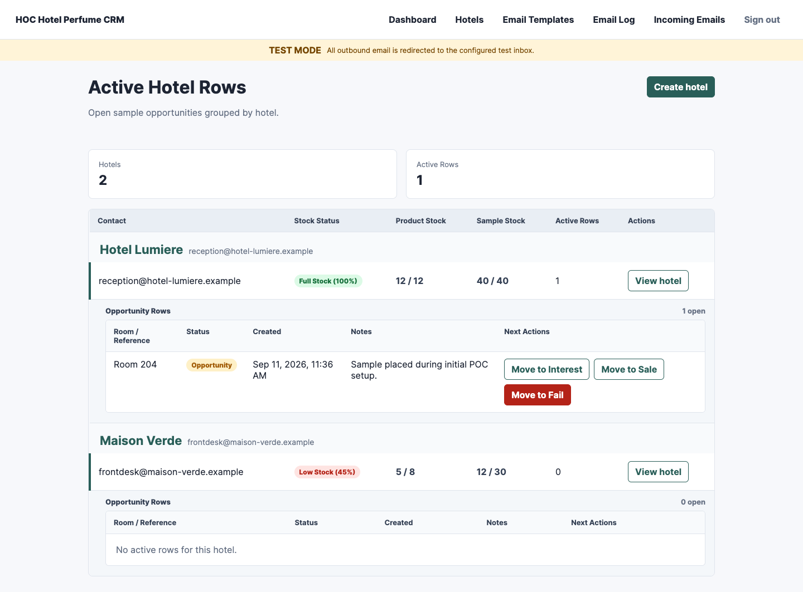
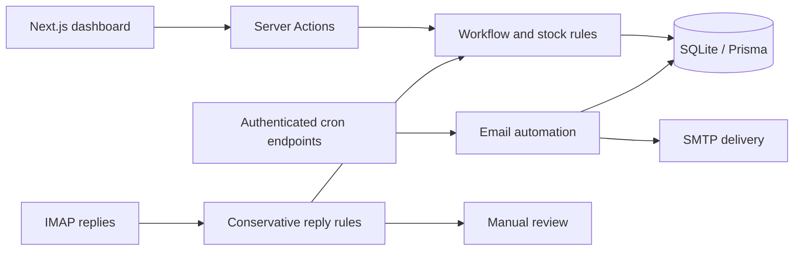

# Hotel Perfume CRM

A full-stack CRM for managing hotel perfume sampling: track room-level opportunities, reconcile stock, and turn receptionist email replies into actionable updates.

Built with **Next.js 16 · React 19 · TypeScript · Prisma · SQLite**.



## The problem

A perfume supplier distributes samples and full-size products to hotels. Reception teams report when samples are placed, used, or converted into purchases, but those updates arrive through email. This application connects that conversation to a structured sales workflow and an inventory audit trail.

## What it does

- **Hotel dashboard:** view hotel contacts, stock levels, and active room opportunities together.
- **Opportunity tracking:** move a room from sample placement to interest, sale, or checkout without purchase.
- **Inventory accounting:** deduct samples and products on the appropriate transitions, prevent negative stock, and record stock events.
- **Email follow-up:** edit templates and schedules, send through SMTP, and track intended and actual recipients.
- **Reply processing:** read IMAP messages, interpret supported room updates, and route ambiguous replies to manual review.
- **Operational controls:** administrator sessions, authenticated cron endpoints, a health endpoint, and a Docker deployment with persistent storage.

## Try it locally

Requires **Node.js 22 or 24** and npm. No external database is needed. Mailbox credentials are only required when exercising email delivery or inbox polling.

```bash
git clone https://github.com/lukadzagania95/hotel-perfume-crm-poc.git
cd hotel-perfume-crm-poc
cp .env.example .env
npm ci
npm run db:generate
touch prisma/dev.db
npm run db:deploy
npm run db:seed
npm run dev
```

Open [localhost:3000](http://localhost:3000) and sign in with the `ADMIN_USERNAME` and `ADMIN_PASSWORD` values from your `.env`. Development seeding creates two fictional hotels and a sample opportunity when the database is empty. Existing hotel data is preserved.

### A quick walkthrough

1. Open the dashboard and inspect Hotel Lumiere's room opportunity.
2. Move the opportunity to **Interest**; sample stock decreases by one.
3. Move it to **Sale**; product stock decreases by one and the row leaves the active dashboard.
4. Open the hotel detail to inspect its closed opportunities and stock history.
5. Explore **Email Templates**, **Email Log**, and **Incoming Emails** for the follow-up workflow.

Email defaults to test mode. Configure your own SMTP/IMAP credentials and test recipient in `.env` before sending or checking the inbox. See the [operations guide](docs/operations.md) for a controlled email walkthrough and deployment instructions.

## How it works



The application keeps business rules in `lib/`, separate from page rendering. Opportunity transitions, inventory deductions, and stock events are committed transactionally. Outbound schedule windows use idempotency keys; incoming replies require a trusted sender, a single room, and a supported transition before they can be applied automatically.

| Layer | Implementation |
| --- | --- |
| UI and server | Next.js App Router, React, Server Actions, custom CSS |
| Language | TypeScript with strict type checking |
| Persistence | Prisma ORM, versioned migrations, SQLite |
| Email | Nodemailer, ImapFlow, Mailparser |
| Verification | Node.js test runner, TypeScript, production build |
| Deployment | Multi-stage Docker image, Docker Compose, Railway configuration |

See [architecture and tradeoffs](docs/architecture.md) for the implemented lifecycle and system boundaries.

## Development

```bash
npm run typecheck  # TypeScript validation
npm test           # Business rules, email safety, and authentication tests
npm run build      # Generate Prisma client and build the application
npm run check      # Run all three checks
```

GitHub Actions runs installation, migrations, seed data, type checking, tests, and the production build on pushes and pull requests.

```text
app/                 Pages, Server Actions, and HTTP endpoints
lib/                 Workflow, inventory, email, and authentication logic
prisma/              Schema, migrations, and demo seed
tests/              Automated rule and safety tests
docs/               Current architecture and operations documentation
  planning/          Original discovery notes and implementation plans
.github/workflows/   Continuous integration
```

## Scope and tradeoffs

This is a focused, single-tenant CRM prototype. SQLite keeps local setup simple and requires one running application instance with persistent storage. Reply interpretation is deterministic and deliberately conservative; it is not an AI classifier. The project does not implement payments, multi-tenant access, or a hotel-facing portal.

Tests currently cover pure business and safety rules; they do not constitute full browser or live-mailbox integration coverage. A multi-instance deployment would require revisiting database and scheduling assumptions.

## Documentation

- [Architecture and tradeoffs](docs/architecture.md)
- [Operations, email setup, and deployment](docs/operations.md)
- [Contributing and verification](CONTRIBUTING.md)
- [Historical product planning](docs/planning/README.md)
