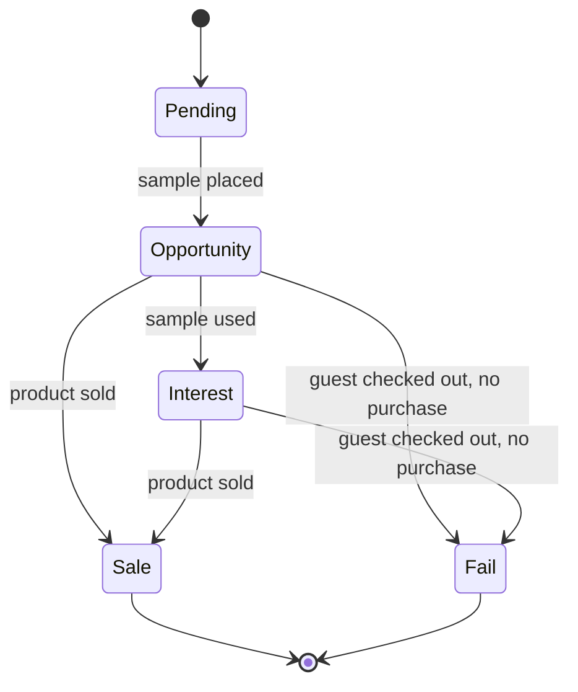

# Status Lifecycle

## Statuses

### Pending

- Default conceptual status.
- No sample placed in room.
- No product sold.
- Pending rows should not be displayed in the main active rows table.

### Opportunity

- Sample placed in room.
- No product sold yet.
- Active status.

### Interest

- Sample placed in room.
- Sample used by guest.
- No product sold yet.
- Active status.
- Subtracts `1` from `Current Sample Stock`.

### Sale

- Sample placed in room.
- Product sold to guest.
- Terminal/closed status.
- Subtracts `1` from `Current Product Stock`.

### Fail

- Sample placed in room.
- Guest checked out without buying the perfume.
- Terminal/closed status.

## Allowed Transitions

- `Pending` -> `Opportunity` when the receptionist reports that a sample was placed in a room.
- `Opportunity` -> `Interest` when the receptionist reports that the sample was used while the guest is still staying at the hotel.
- `Opportunity` -> `Sale` when the receptionist reports that the guest purchased the perfume.
- `Opportunity` -> `Fail` when the receptionist reports that the guest checked out without purchasing.
- `Interest` -> `Sale` when the receptionist reports that the guest purchased the perfume.
- `Interest` -> `Fail` when the receptionist reports that the guest checked out without purchasing.

`Sale` and `Fail` are terminal statuses.

## Stock Impact

- `Pending`: no stock deduction.
- `Opportunity`: no stock deduction by default.
- `Interest`: subtract `1` from `Current Sample Stock`.
- `Sale`: subtract `1` from `Current Product Stock`.
- `Fail`: no product stock deduction. Sample stock deduction is an open question if usage was never reported.

Stock deductions should happen only once for the relevant event.

## Mermaid State Diagram

## Display Rules

- `Pending` is conceptual and should not display in the main active rows table.
- `Opportunity` and `Interest` are active statuses.
- `Sale` and `Fail` are closed statuses.

## Automation Notes

Statuses should eventually be automatically updated based on incoming email responses from hotel receptionists. Incoming emails should be interpreted in context and mapped to row creation, row status updates, and stock deductions where applicable.
