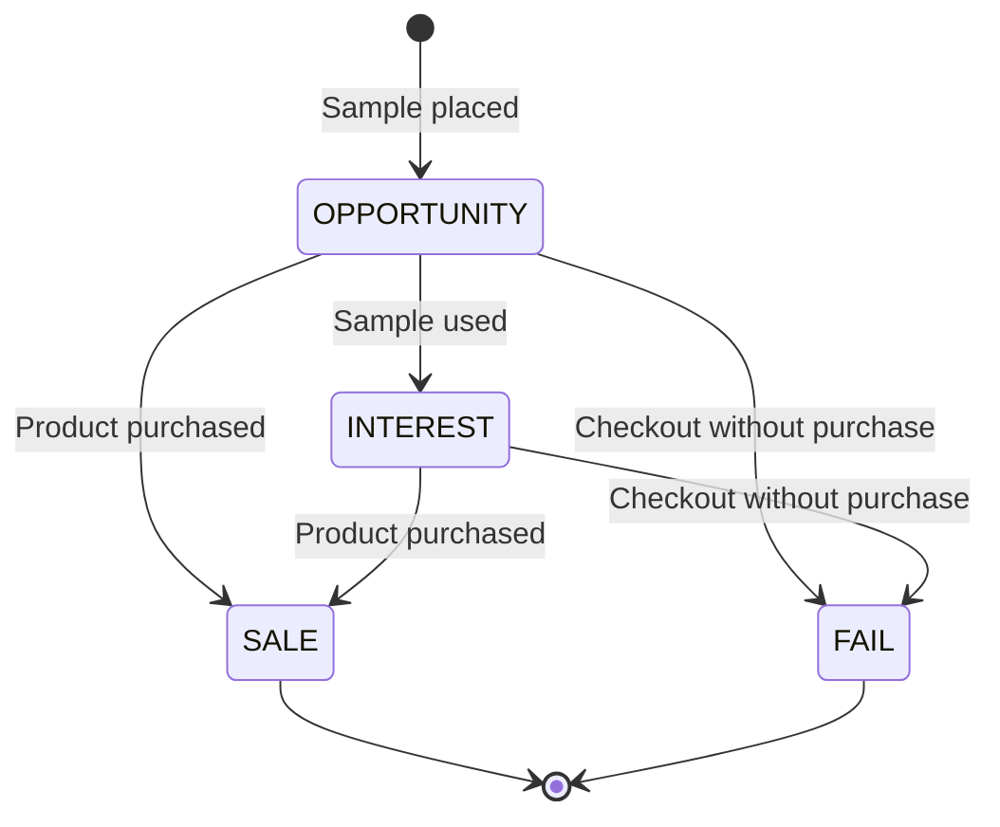

# Architecture and tradeoffs

## Request flow

Next.js renders the dashboard and hotel/email pages on the server. Server Actions validate form input and call the services in `lib/`. Prisma owns database access; schema changes are tracked in `prisma/migrations/`.

HTTP route handlers expose login/logout, readiness, and scheduler endpoints. `proxy.ts` protects application access in production; cron handlers validate a separate bearer secret.

## Opportunity lifecycle

The implemented states are `OPPORTUNITY`, `INTEREST`, `SALE`, and `FAIL`. New room opportunities start at `OPPORTUNITY`; the conceptual `PENDING` state in early planning documents is not part of the current schema.

Entering `INTEREST` deducts one sample. Entering `SALE` deducts one product; a direct sale does not imply sample consumption. `SALE` and `FAIL` are terminal. Deduction flags guard against charging the same stock effect twice, and the workflow rejects changes that would make stock negative.

## Email processing

Outbound automation selects eligible templates based on opportunity states and frequency. Send records preserve message snapshots and intended/actual recipients. Test mode redirects delivery to one configured test inbox; live delivery requires two explicit environment switches.

Incoming processing reads unread IMAP messages and applies conservative phrase/room rules. Unsupported or ambiguous messages remain available for manual review. Automatic application requires trusted sender matching and a valid opportunity transition. Database changes for a reply and its stock effects are transactional.

## Important boundaries

- **Single tenant:** one administrator account, with no organization isolation or role hierarchy.
- **Single instance:** SQLite uses a persistent file; multiple application writers are outside the supported deployment profile.
- **External email:** SMTP delivery and a database transaction cannot form one atomic operation. Schedule deduplication reduces repeated sends but does not provide an exactly-once delivery guarantee across external failures.
- **Conservative interpretation:** no LLM dependency or claim of arbitrary natural-language understanding.
- **Verification:** existing tests exercise authentication helpers, recipient safeguards, lifecycle transitions, email eligibility, and reply interpretation. Full database, browser, and provider integration tests are future work.

## Repository history

The [planning archive](planning/README.md) preserves the original product discovery and proposed MVP. It includes ideas that were deferred or changed during implementation. Current behavior is described here and in the root README; the schema and service code are the source of truth.
